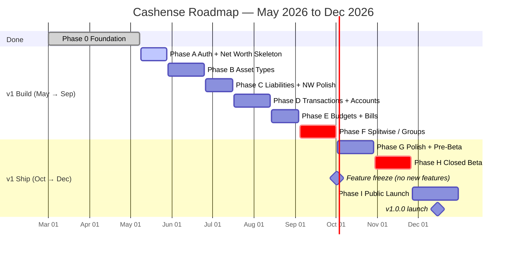
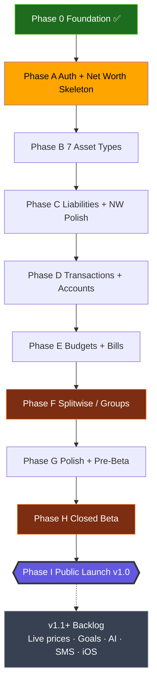
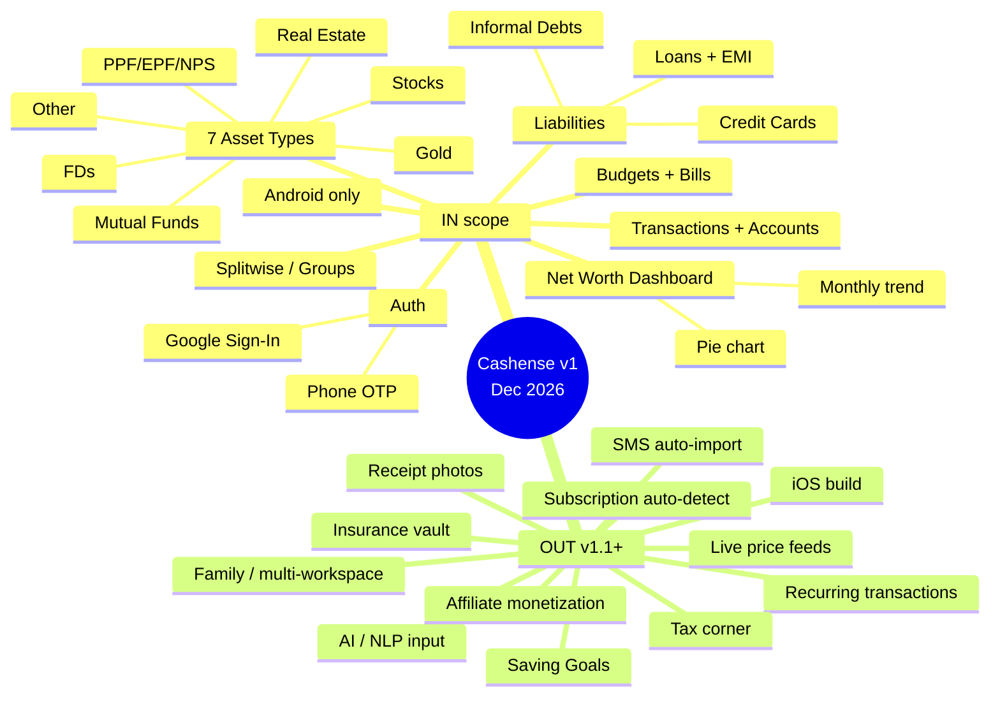

# Cashense — Roadmap

> **Version:** 2.0 | **Last Updated:** May 8, 2026 | **Owner:** Yaksi
>
> Single source of truth for *why*, *what*, *when*, and *how* we build Cashense.
> Replaces the old `MASTER_PLAN.md`, `PRD.md`, `AGENT_WORKFLOW.md`, and `REMAINING_TASKS.md`.

---

## 1. Vision

> **"Every rupee you own, owe, earn, or insure — visible in one place."**

Cashense is a personal finance super-app for India that combines Splitwise-style group splitting, daily expense/budget tracking, and a complete net-worth dashboard (assets + liabilities). One app instead of juggling Splitwise, spreadsheets, broker apps, bank apps, and insurance folders.

---

## 2. The Wedge — Net Worth Dashboard

The product does many things. **Marketing leads with one:** *"See everything you own and owe in one screen."*

Every Day-1 surface — Play Store screenshots, share cards, the first thing a friend hears — is built around the **Net Worth Dashboard**. Other features (transactions, budgets, Splitwise) are the *retention* and *daily-use* layers underneath.

**Implication for the build:** the net worth screen goes on screen *early* (Phase A) with empty state, and every subsequent feature makes it richer. We do not build it last.

---

## 3. v1 Scope (Locked) — Ship by **December 31, 2026**

### IN

| Area | Features |
|------|----------|
| **Auth** | Google Sign-In + Phone OTP |
| **Home dashboard** | Net worth header, recent transactions, budget strip, quick-add FAB, bottom nav |
| **Net worth** | Real-time sum, monthly delta, asset-class pie, monthly trend chart (populates over time) |
| **Assets (manual values)** | FDs, Mutual Funds, Stocks, Gold, Real Estate, PPF/EPF/NPS, Other |
| **Liabilities** | Home/Car/Personal/Education loans (with EMI math), Credit Cards, Informal debts |
| **Transactions** | Income/expense/transfer, 30+ Indian categories, custom categories, account picker, notes |
| **Accounts** | Bank, Cash, UPI Wallet, Credit Card. Auto-balance from transactions. |
| **Budgets** | Monthly per-category. Color-coded (green/yellow/red). 80% & 100% local alerts. |
| **Bills** | Bills list, 7-day & 1-day local-notification reminders, mark-as-paid → creates transaction |
| **Splitwise (Groups)** | Create groups, add expense with split modes (equal / % / exact / shares), debt simplification, settle-up with UPI deep link, settlement history |
| **Platform** | Android only (Play Store) |

### OUT (deferred to v1.1+, see §10)

- AI / NLP transaction input
- SMS auto-import (Android bank SMS parsing)
- Saving goals
- Recurring transactions (auto-create monthly)
- Receipt photo attachment
- Subscription auto-detect from transactions
- Live price feeds (AMFI NAV, stocks, gold) — **everything stays manual at launch**
- Insurance vault
- Tax corner (80C, capital gains, PDF export)
- Analytics screen (deep charts beyond home strip)
- iOS build
- Multi-workspace / Family mode
- Affiliate / monetization integration

---

## 4. Locked Decisions (Decision Log)

| # | Decision | Date | Rationale |
|---|----------|------|-----------|
| D1 | MVP = Phases 0–3 from old plan + Bills | 2026-05-08 | Founder wants full super-app pitch; willing to accept tight timeline |
| D2 | Marketing wedge = Net Worth Dashboard | 2026-05-08 | Differentiates from every Walnut/Money Manager clone |
| D3 | Build net-worth screen early, fill in over time | 2026-05-08 | De-risks launch hero; reduces "all-or-nothing" risk |
| D4 | Asset values **manual only** at v1 | 2026-05-08 | No backend dependency; ship faster; live feeds are v1.1 |
| D5 | Auth: Google + Phone OTP | 2026-05-08 | Phone OTP dominates Indian apps; skip email/password noise |
| D6 | Android-first; iOS deferred | 2026-05-08 | Larger Indian base, faster to launch, iOS Google client IDs no longer block us |
| D7 | Closed beta with 10–20 friends/family for ~4 weeks before public Play Store | 2026-05-08 | Founder's first 100 users come from network anyway |
| D8 | Free + affiliate monetization, deferred to post-launch | 2026-05-08 | Build affiliate-friendly UX hooks but no integration in v1 |
| D9 | Bills use **local notifications** (no FCM/Cloud Functions) | 2026-05-08 | Saves backend work; sufficient for single-device user |
| D10 | All 7 asset types in v1 | 2026-05-08 | Founder commitment to "everything combined" — non-negotiable |
| D11 | Splitwise (groups) stays in v1 | 2026-05-08 | Part of super-app pitch; must compensate via discipline elsewhere |
| D12 | One ROADMAP.md replaces MASTER_PLAN/PRD/AGENT_WORKFLOW/REMAINING_TASKS | 2026-05-08 | Single source of truth |

If a decision needs to change, it gets a new row with a date — the old one stays for history.

---

## 5. Phase Plan (May → December 2026)

> Realistic capacity: solo dev + occasional contractor at ~60% of theoretical hours = roughly **20 productive weeks** across 7.5 months. The plan below assumes that. Each phase ends with a checklist; do not start the next phase until the current one passes.

### Phase 0 — Foundation (already done) ✅
- Routing (`lib/routes/*` — 4 files)
- 9 core models (`lib/data/models/*`)
- Home dashboard scaffold (empty state)
- Auth scaffolding (Google works on Android, iOS blocked but deferred)

### Phase A — Auth + Net Worth Skeleton (May 9 – May 28, ~3 weeks)

**Why first:** The hero screen needs to exist before users can ever see it, and Phone OTP is non-negotiable for India.

**Build:**
- `lib/features/authentication/` — add Phone OTP flow (good contractor task)
- `lib/features/net_worth/` — scaffold dashboard with **empty state** (zero values, "Add your first asset" CTA)
- `lib/features/assets/` and `lib/features/liabilities/` — list-screen shells, type-picker, repository pattern
- Bottom navigation: Home / Wealth / Transactions (placeholder) / Settings

**Phase A Done When:**
- [ ] Phone OTP login works end-to-end
- [ ] Net worth screen renders with ₹0 and a CTA
- [ ] Tapping Wealth tab shows empty assets/liabilities lists
- [ ] `flutter analyze` → 0 errors

---

### Phase B — Asset Types (May 29 – Jun 25, ~4 weeks)

**Why now:** Each asset type added makes the hero screen more compelling. Contractor-friendly.

**Build (one type per ~3 days):**
- FDs — bank, principal, rate, maturity, auto-calc maturity amount
- Mutual Funds — scheme, units, buy NAV, current NAV (manual)
- Stocks — exchange, symbol, qty, buy price, current price (manual)
- Gold — type (physical/digital/SGB), grams, buy/current price per gram
- Real Estate — name, address, purchase value, estimated current value
- PPF/EPF/NPS — account no., balance, last updated
- Other — generic name + current value

**Each asset type needs:** add screen, list card, edit, delete, contributes to net worth sum.

**Phase B Done When:**
- [ ] All 7 asset types create/edit/delete in Firestore
- [ ] Net worth screen total = sum of all asset current values (verified math)
- [ ] Asset breakdown pie chart shows correct slices
- [ ] Each form has input validation

---

### Phase C — Liabilities + Net Worth Polish (Jun 26 – Jul 16, ~3 weeks)

**Build:**
- Loans — Home/Car/Personal/Education with EMI schedule formula, remaining principal auto-calc
- Credit Cards — limit, outstanding, billing date, due date
- Informal Debts — person, amount, due date, note
- Net worth = Σ assets − Σ liabilities
- Monthly snapshot stored in `users/{uid}/networth_snapshots/{YYYY-MM}` for trend chart
- `fl_chart` integration for trend line + asset pie

**Phase C Done When:**
- [ ] Add loan → net worth decreases by remaining principal
- [ ] EMI schedule sheet shows correct breakdown
- [ ] Monthly snapshot writes successfully on the 1st
- [ ] Pie + trend chart render correctly

---

### Phase D — Transactions + Accounts (Jul 17 – Aug 13, ~4 weeks)

**Build:**
- `lib/features/accounts/` — Bank/Cash/UPI Wallet/Credit Card. Per-account balance auto-derived from transactions.
- `lib/features/transactions/` — add/edit/delete, category picker (30+ categories), account picker, notes, tags
- Transfer between accounts (creates two opposing transactions, no double-count in net flow)
- Recent transactions widget on home
- Filters: by account, category, date range
- Search

**Phase D Done When:**
- [ ] Add transaction → account balance updates
- [ ] Transfer doesn't double-count
- [ ] Home shows last 5 transactions
- [ ] Filter + search work

---

### Phase E — Budgets + Bills (Aug 14 – Sep 3, ~3 weeks)

**Build:**
- `lib/features/budgets/` — monthly per-category, color-coded progress, 80% & 100% local notifications
- `lib/features/bills/` — list, due-date sorting, 7-day & 1-day local-notification reminders, mark-as-paid → creates transaction
- `flutter_local_notifications` integration (Android-only is fine)

**Phase E Done When:**
- [ ] Set ₹5,000 food budget → spending hits 80% → notification fires
- [ ] Add bill due tomorrow → reminder fires at 9am
- [ ] Mark bill paid → transaction appears in account
- [ ] Budget over 100% shows red

---

### Phase F — Splitwise / Groups (Sep 4 – Oct 1, ~4 weeks)

**Why this late:** It's not the launch hero, it's a 4-week build, and it's the most complex feature. Doing it close to launch keeps it fresh.

**Build:**
- `lib/features/groups/` — create group, member management (invite by phone)
- Add expense with split modes: equal, percentage, exact amounts, shares
- Real-time Firestore listeners (group members see changes live)
- Debt simplification algorithm (minimize transactions to settle all balances)
- Settle-up flow with UPI deep link (`upi://pay?pa=...`)
- Settlement history

**Phase F Done When:**
- [ ] Create 3-person group, add ₹300 split equally → each owes ₹100
- [ ] A→B ₹100 + B→C ₹100 simplifies to A→C ₹100
- [ ] Settle up creates a debt-cleared transaction
- [ ] UPI deep link opens GPay/PhonePe

---

### Phase G — Polish + Pre-Beta (Oct 2 – Oct 29, ~4 weeks)

**Build:**
- Onboarding flow (first-time setup: add first account, first asset)
- Empty-state illustrations across all screens
- Loading states, error handling, retry flows
- Firestore security rules audit
- Crashlytics + Analytics integration
- App icon, splash screen, Play Store listing copy
- Performance pass (rebuilds, list virtualization)
- `flutter analyze` → 0 errors, 0 warnings

**Phase G Done When:**
- [ ] First-time user can complete setup in <2 minutes
- [ ] Crashlytics receives a test crash
- [ ] Internal Play Store track is published
- [ ] Founder dogfoods for 1 week without a blocker

---

### Phase H — Closed Beta (Oct 30 – Nov 26, ~4 weeks)

**Process:**
- Invite 10–20 friends/family via Play Store internal track
- Weekly new build cycle
- Daily bug-fix reactivity
- Track top issues in `docs/BETA_FEEDBACK.md` (created at start of phase)
- **Feature freeze** — only bugs and copy fixes get merged

**Phase H Done When:**
- [ ] 10+ active testers for 2+ weeks
- [ ] Top 3 reported bugs fixed
- [ ] Crash-free session rate > 99%
- [ ] Founder is comfortable with public release

---

### Phase I — Public Launch (Nov 27 – Dec 31)

**Process:**
- Promote to Play Store production track
- Soft launch (no announcement) for 1 week — watch metrics
- Announcement to network (Twitter, LinkedIn, WhatsApp groups)
- Daily metric review
- Hot-fix readiness

**Launch Done When:**
- [ ] App live on Play Store
- [ ] First 100 installs
- [ ] Founder has shipped one bug-fix update post-launch

---

## 6. Scope Discipline Rules

> The founder named "scope creep" as the #1 fear. These rules are how we protect against it.

1. **No new features past Oct 1.** From Phase G onwards, only bugs, polish, and copy. Anything else goes to v1.1 backlog.
2. **The cuts list (§3 OUT) is sacred.** New requests for AI / SMS / goals / receipts / live prices automatically land in v1.1 — they do not re-open.
3. **One feature on screen before moving to the next.** A half-built screen does not get added to. Finish, then move on.
4. **Weekly check-in (Mondays):** review what shipped last week, what's planned this week. If a phase is 1 week behind, drop the lowest-value sub-feature in the current phase, not the next phase.
5. **The Decision Log (§4) is append-only.** Reversing a decision means a new row with reasoning, not a silent edit.
6. **"Want to add X?" → write it in `docs/V1_BACKLOG.md`** (created when first item arrives). Never add to active phase.
7. **Every Friday, ask: "Is what shipped this week visible to a beta tester?"** If no, the work was probably scaffolding — flag and adjust the next week.

---

## 7. How We Work Together

### Cycle for each phase

```
1. Agent: "Starting Phase X — [name]. Files to create/modify: [...]"
2. Human: Review file list, approve or adjust
3. Agent: Implement
4. Agent: Provide test checklist (matches Phase Done When)
5. Human: Run flutter analyze, manual test
6. Human: "all done" or "[issue]"
7. Agent: If issue → fix. If done → give git commands
8. Human: Execute git commands
9. Agent: Update ROADMAP.md status, proceed to next phase
```

### Roles

| Action | Owner |
|--------|-------|
| Create files, write code | Agent |
| Update routes, bindings, pubspec | Agent |
| Run `flutter pub get` | Human |
| Run `flutter analyze` | Human |
| Manual device testing | Human |
| Execute `git commit/push` | Human |
| Approve phase completion | Human |
| Update ROADMAP status | Agent (after human's "all done") |

### Communication shorthand

- **"all done"** — proceed to next phase
- **"[bug description]"** — agent fixes, then re-presents checklist
- **"skip X"** — defer the sub-feature, note it in `docs/V1_BACKLOG.md`
- **"done with phase N"** — mark phase complete in this file

### Hard rules

1. Agent never commits — only gives commands.
2. Never start a new phase without the current phase's checklist complete.
3. After every `pubspec.yaml` change, remind human to run `flutter pub get`.
4. All Firestore access goes through a Repository class, never direct in controllers.
5. Any API key (OpenAI, etc., when added later) goes through Firebase Cloud Functions — never in client code.
6. Old working code stays intact until new code is confirmed working.

---

## 8. Tech Stack

| Layer | Choice | Notes |
|-------|--------|-------|
| Framework | Flutter ^3.8.1 | Already chosen |
| State | GetX | Already wired; sticking with it for v1 |
| Navigation | go_router | Already configured |
| Backend | Firebase (Auth, Firestore) | Multi-flavor: cashense-dev / staging / prod |
| Local DB | Drift (configured but unused) | Defer real use to v1.1 if offline becomes a need |
| HTTP | Dio | For future external APIs |
| Charts | `fl_chart` | Add in Phase C |
| Notifications | `flutter_local_notifications` | Add in Phase E. **No FCM in v1.** |
| Auth | Firebase Auth (Google + Phone OTP) | Phone OTP added in Phase A |
| Analytics | Firebase Analytics + Crashlytics | Add in Phase G |
| AI | *(deferred)* | OpenAI gpt-4o-mini via Cloud Functions, post-v1 |

---

## 9. Test & Release Checklist (per phase)

```
[ ] flutter analyze → 0 errors, 0 new warnings
[ ] flutter run --flavor dev -t lib/flavors/main_development.dart on a real Android device
[ ] All "Phase Done When" checklist items pass
[ ] Manual smoke test: log in, navigate to new screens, add a record, edit it, delete it
[ ] No console errors or yellow warnings during smoke test
[ ] Firestore reads/writes visible in Firebase console
```

Pre-public-launch (end of Phase H):
```
[ ] Crash-free session rate > 99% over 2 weeks of beta
[ ] Firestore security rules deny unauthenticated reads
[ ] App icon and splash render correctly
[ ] Play Store listing complete (description, screenshots, privacy policy URL)
[ ] Production Firebase project (cashense) is the target
[ ] Beta feedback top 3 issues addressed
```

---

## 10. v1.1+ Backlog (Post-Launch)

Tracked here, not in active sprints. Order is rough priority, not commitment.

| # | Feature | Notes |
|---|---------|-------|
| 1 | Live price feeds | AMFI NAV (free, official) for MFs first. Stocks via Yahoo unofficial. Gold via MCX. |
| 2 | Saving Goals | Linked to assets/accounts. AI-suggested monthly contribution comes later. |
| 3 | Subscription tracker | Auto-detect from transactions. Renewal reminders. |
| 4 | Recurring transactions | Auto-create monthly entries (salary, rent). |
| 5 | Receipt photo attachment | Firebase Storage integration. |
| 6 | AI / NLP transaction input | "spent 500 on lunch" → draft. OpenAI via Cloud Functions. |
| 7 | SMS auto-import | Android only. Regex per major bank. Confirm-before-save flow. |
| 8 | Analytics screen | Spending trend, category pie, income vs expense, cash-flow waterfall. |
| 9 | Insurance vault | Term/health/vehicle/home policies with renewal alerts. |
| 10 | Tax corner | 80C tracker, capital gains (STCG/LTCG), PDF export. |
| 11 | iOS build | Fill iOS Google client IDs in `flavor_constants.dart`, ship to TestFlight. |
| 12 | FD maturity & price alerts | Cloud Functions cron job. |
| 13 | Multi-workspace / Family mode | Workspace = shared finance space. Roles: admin/editor/viewer. |
| 14 | Affiliate integrations | FD aggregators, MF distributors, insurance brokers. Monetization. |
| 15 | Advanced tax | GST invoice gen, Form 16 upload, advance tax calc, HRA, Section 24. |

### Future Scope (Post v1.x, no commitment)
- Credit score tracker (CIBIL/Experian)
- Crypto portfolio (CoinGecko)
- Will & nominee manager
- Cashback tracker
- SIP planner
- Loan payoff simulator
- Receipt OCR
- WhatsApp bot
- Home screen widget (glanceable net worth)
- Couple finance mode

---

## 11. Risks & Mitigations

| Risk | Likelihood | Impact | Mitigation |
|------|-----------|--------|------------|
| Scope creep (founder's #1 fear) | High | Severe | Rules in §6. Backlog file. Hard freeze Oct 1. |
| Phase F (Splitwise) blows the timeline | Med | High | If Phase E ends >1 week late, Splitwise drops to v1.1. Trigger: Sep 11 status. |
| Solo velocity drops (life, day job) | Med | Med | Plan assumes ~60% of theoretical capacity. Contractor available for Phone OTP, asset forms. |
| Closed beta uncovers fundamental issue | Low | High | Beta starts Oct 30, leaves 8+ weeks before Dec 31. Architecture pass during Phase G. |
| Firestore cost spike | Low | Med | Composite indexes set up early. Pagination on transaction lists. |
| Asset type breadth → shallow polish | Med | Med | Each type follows the same skeleton; first one (FD) is the template, others slot in. |
| Manual asset values feel dead | Med | Med | Net worth dashboard masks staleness via "as of" labels. v1.1 live feeds. |
| Affiliate model unclear at launch | Low | Low | Free at launch; affiliate is post-launch decision; no architectural lock-in. |

---

## 12. Where Things Live

| File | Purpose |
|------|---------|
| `CLAUDE.md` | Base file Claude reads first every session |
| `docs/ROADMAP.md` | This file — vision, scope, phases, decisions |
| `docs/FIRESTORE_SCHEMA.md` | Collection structure reference |
| `docs/V1_BACKLOG.md` | Created when first deferred request lands |
| `docs/BETA_FEEDBACK.md` | Created at start of Phase H |
| `lib/features/<name>/` | One folder per feature, GetX pattern |
| `lib/data/models/` | All Firestore models with toJson/fromJson/fromFirestore/copyWith |
| `lib/routes/` | go_router config |
| `lib/utils/constants/flavor_constants.dart` | iOS OAuth TODOs (deferred to v1.1+) |

---

## 13. Status

| Phase | Status | Target End |
|-------|--------|-----------|
| 0 — Foundation | ✅ Done | — |
| A — Auth + Net Worth Skeleton | ⏳ Next | May 28 |
| B — Asset Types | Pending | Jun 25 |
| C — Liabilities + Net Worth Polish | Pending | Jul 16 |
| D — Transactions + Accounts | Pending | Aug 13 |
| E — Budgets + Bills | Pending | Sep 3 |
| F — Splitwise / Groups | Pending | Oct 1 |
| G — Polish + Pre-Beta | Pending | Oct 29 |
| H — Closed Beta | Pending | Nov 26 |
| I — Public Launch | Pending | Dec 31 |

Update statuses as phases complete. Append rows to Decision Log when anything in §3 or §4 changes.

---

## Appendix A — Visual Roadmap (Mermaid Gantt)

> Renders inline on GitHub. Local preview: any Mermaid-aware viewer (VS Code Mermaid Preview, mermaid.live).



---

## Appendix B — Phase Dependency Graph



**Legend:** orange = critical-risk phase (Splitwise complexity, Closed Beta gate), green = done, purple = launch milestone.

---

## Appendix C — Scope at a Glance (Mermaid Mindmap)


