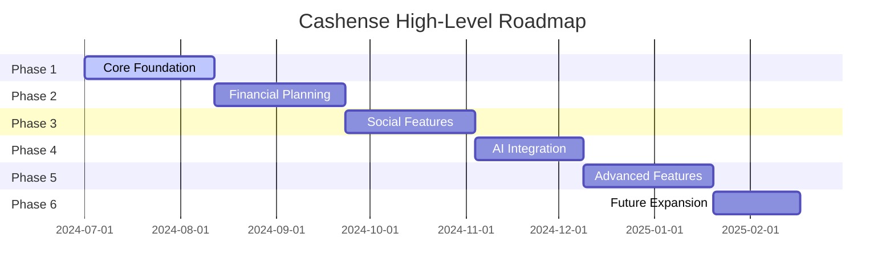

# 🛣️ Cashense Implementation Roadmap

## Phase 1: Core Foundation
1. **Accounts & Sub-Accounts** - Basic structure with wallet, bank, and custom accounts
2. **Expense Tracking** - Simple transaction logging with categories
3. **Cash & Manual Handling** - Basic cash transaction tracking
4. **Multi-Device Sync** - Core data synchronization
5. **Offline Support** - Basic offline functionality

## Phase 2: Financial Planning
6. **Budgeting** - Monthly and category-wise budget setup
7. **Saving Goals** - Define and track financial goals
8. **Recurring Transactions** - Setup for regular income/expenses
9. **Subscription Manager** - Track recurring subscriptions
10. **Analytics & Insights** - Basic visualizations and reports

## Phase 3: Social Features
11. **Group Expenses** - Add and split expenses with friends/family
12. **Debt Tracker** - Money lent/borrowed tracking
13. **Multi-Workspace** - Separate spaces for personal/business finances
14. **Smart Settlement** - Auto debt clearing within groups

## Phase 4: AI Integration
15. **AI Assistant** - Natural language processing for transactions
16. **Voice Commands** - Speech recognition for hands-free operation
17. **Smart Onboarding** - AI-recommended templates
18. **AI-Powered Saving Strategies** - Personalized recommendations
19. **Smart Reminders & Alerts** - Contextual notifications

## Phase 5: Advanced Features
20. **Linked Accounts** - Bank integration for auto-syncing
21. **Security Enhancements** - Biometric auth, encryption
22. **Customization Options** - Themes, font sizes, accessibility
23. **Investment Tracking** - Monitor stocks, mutual funds, crypto
24. **Financial Tips Integration** - Quick tips on loading screens and dashboards

## Phase 6: Future Expansion
25. **Multi-language Support**
26. **AR Integration** for receipt scanning
27. **Budget Gamification** with rewards
28. **Financial Education Modules**
29. **UPI & Payment Integration**
30. **Community-Driven Features** 

