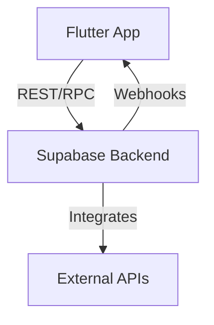

# 📂 Project Structure

```
cashense/
├── android/               # Android-specific configuration 
├── ios/                   # iOS-specific configuration
├── lib/
│   ├── core/              # Core utilities and constants
│   │   ├── constants/     # App constants, strings, etc.
│   │   ├── errors/        # Error handling
│   │   ├── network/       # Network service and interceptors
│   │   ├── storage/       # Local storage services
│   │   └── utils/         # Utility functions
│   ├── data/
│   │   ├── models/        # Data classes and models
│   │   ├── repositories/  # Repositories to manage data sources
│   │   ├── sources/       # Data sources (remote, local)
│   │   └── services/      # Backend services
│   ├── di/                # Dependency injection
│   ├── domain/
│   │   ├── entities/      # Domain entities
│   │   ├── repositories/  # Repository interfaces
│   │   └── usecases/      # Business logic use cases
│   ├── presentation/
│   │   ├── blocs/         # BLoC state management
│   │   ├── pages/         # UI pages/screens
│   │   ├── providers/     # Provider state management
│   │   └── widgets/       # Reusable widgets
│   ├── features/          # Feature modules
│   │   ├── accounts/      # Accounts feature
│   │   ├── transactions/  # Transaction feature
│   │   ├── budgets/       # Budget feature
│   │   ├── goals/         # Goals feature
│   │   ├── groups/        # Group expenses feature
│   │   ├── ai/            # AI integration
│   │   └── ...            # Other features
│   ├── l10n/              # Localization resources
│   ├── routes/            # App routing
│   ├── theme/             # App theming
│   ├── main.dart          # App entry point
│   └── app.dart           # App component
├── assets/                # App assets (images, fonts, etc.)
├── test/                  # Unit and widget tests
├── integration_test/      # Integration tests
├── docs/                  # Documentation
├── pubspec.yaml           # Project dependencies
└── README.md              # Project overview
``` 



