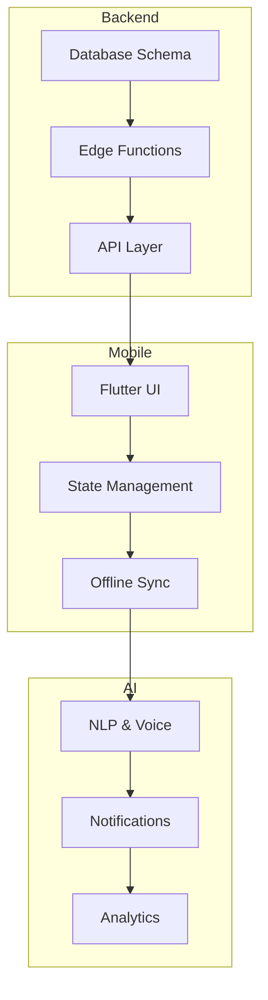

# Team Collaboration Plan

To maximize productivity with three developers, tasks are divided into parallel streams. Each developer owns a stream but collaborates via code reviews and shared documentation.

## Developer Roles

1. **Backend Specialist**
   - Set up Supabase and maintain the database schema.
   - Implement Edge Functions and API endpoints.
   - Manage authentication and security policies.
2. **Mobile & UI Specialist**
   - Build Flutter screens and widgets following the design system.
   - Implement state management with Riverpod.
   - Handle local storage and offline sync logic.
3. **AI & Integration Specialist**
   - Integrate OpenAI for NLP features and voice commands.
   - Set up notifications (FCM) and third-party services.
   - Work on analytics and advanced features.

## Parallel Workflow

Weekly sync meetings ensure alignment across streams. All developers update progress in the relevant `phase_progress` file and review pull requests in the `develop` branch.

